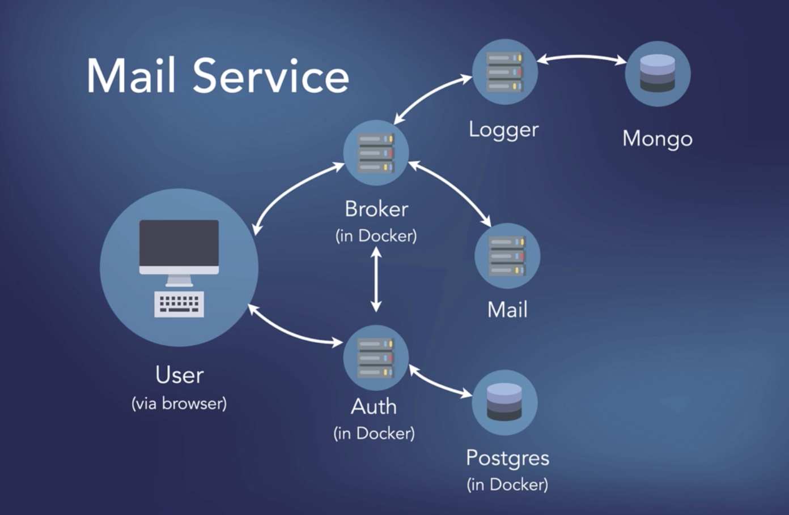

## Working with Microservices in Go (Golang)



**Install**

```
$ cd project
$ make up_build
$ make start 
```

## What's inside:
- Authentication
- Logging
- Send email

## Libraries
1. **Chi** [https://github.com/go-chi/chi]
2. **Simple mail** [https://github.com/xhit/go-simple-mail]
3. **Postgres** [github.com/jackc/pgx/v4]
4. **Mongodb** [go.mongodb.org/mongo-driver]
